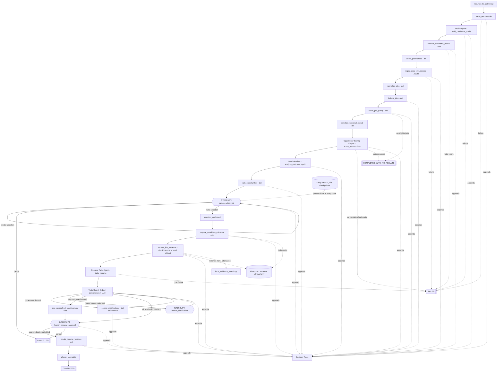
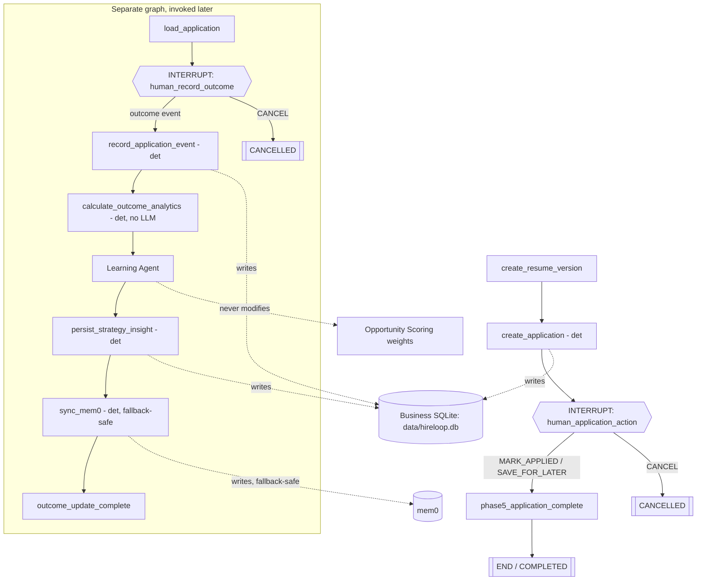

# HireLoop AI — MVP Architecture v1.0

Status: **Frozen (target design) / Phase 6 implemented — certification MVP complete**

This document describes the full target architecture and marks what is
actually implemented as of Phase 6 (the final certification phase). For the detailed
LangGraph mechanics of what's implemented today (node list, routing,
checkpointing, error taxonomy, example runs), see **[docs/WORKFLOW.md](WORKFLOW.md)**
— this file stays the higher-level system picture. For Truth Guard's full
design, see **[docs/TRUTH_GUARD.md](TRUTH_GUARD.md)**; for application
tracking, outcome analytics, the Learning Agent, and mem0, see
**[docs/LEARNING_LOOP.md](LEARNING_LOOP.md)**.

## 1. Overview

HireLoop AI is a self-improving, multi-agent job search system built as a
LangGraph-orchestrated workflow with deterministic Python for all
non-judgment tasks and a small set of specialized agents for tasks that
genuinely require reasoning. It is optimized for **interview opportunity
quality**, not ATS keyword matching.

**Implemented through Phase 5:** resume parsing → Profile Agent → profile
validation → preference intake → seeded job ingestion → normalization →
deduplication → job quality scoring (including requirement-completeness
hardening) → historical signal → deterministic Opportunity Scoring →
Match Analyst (top-N) → deterministic ranking → **human job-selection
interrupt** → candidate evidence preparation → job-requirement evidence
retrieval (Pinecone or deterministic local fallback) → Resume Tailor →
Truth Guard (hybrid deterministic + LLM, fail-closed) → bounded automated
correction → **human clarification interrupt** → **human resume-approval
interrupt** → ResumeVersion creation → application record creation →
**human application-action interrupt** (mark applied / save for later /
cancel — never submitted externally), all in one checkpointed LangGraph
graph. A **separate** graph entry point (invoked days/weeks later)
handles outcome recording: load the application → **human outcome
interrupt** (with suspicious-sequence warnings) → append an
ApplicationEvent → recompute deterministic OutcomeAnalytics → Learning
Agent → persist the resulting insight → sync to mem0 (with fallback).

**Implemented in Phase 6:** the full Streamlit product (`app.py`) — every
page is a thin renderer over the real LangGraph state and every mutating
action resumes the same graph via `Command(resume=...)`, so the UI drives
the identical state machine the test suite exercises, not a parallel
simulation. Also added: an independent **actionability** classification
(`src/services/actionability.py`) that separates *sample confidence* from
*effect size*, so a strategy insight can be sample-adequate but still
correctly flagged `NO_CLEAR_SIGNAL` when the observed difference is too
small to act on; and an eleven-category evaluation harness (`evals/`,
`python -m evals.run_evals`) that exercises real backend code — not a
re-description of the pytest suite — including ≥20 adversarial Truth Guard
cases and simulated provider/input failure scenarios.

**Permanently out of scope for this project:** automatic application
submission, live job-board scraping, n8n, ElevenLabs, recruiter outreach,
and multi-user authentication. These are not "later phases" — see
[PROJECT_OVERVIEW.md](PROJECT_OVERVIEW.md)'s roadmap section.

## 2. System Diagrams

### 2a. Implemented (Phase 3 + Phase 4)



See docs/WORKFLOW.md for the full node table, routing functions, error
taxonomy, and checkpointing details. See docs/TRUTH_GUARD.md for Truth
Guard's internal three-layer pipeline.

### 2b. Phase 5: application tracking + learning loop (Implemented)



Not yet implemented: automatic external application submission (this
workflow only ever records what the human says happened).

## 3. State Model

The full `HireLoopState` (implemented) lives in `src/graph/state.py` and is
documented field-by-field in docs/WORKFLOW.md. Summary:

```python
class HireLoopState(TypedDict, total=False):
    run_id: str
    candidate_id: str
    resume_file_path: str

    resume_parse_result: dict     # ResumeParseResult
    candidate_profile: dict       # CandidateProfile
    profile_validation: dict      # ProfileValidationResult
    preferences: dict

    raw_jobs: list[dict]
    normalized_jobs: list[dict]
    deduped_jobs: list[dict]
    duplicate_results: list[dict]
    job_quality_results: dict[str, dict]

    historical_signal_context: dict[str, dict]
    opportunity_scores: dict[str, dict]   # job_id -> OpportunityScore
    match_analyses: dict[str, dict]       # job_id -> MatchAnalysis
    ranked_job_ids: list[str]

    selected_job_id: str | None
    human_job_selection_status: str

    # Phase 4: candidate evidence + job requirement evidence
    candidate_evidence: list[dict]              # flattened Evidence chunks
    evidence_index_status: str                  # "PINECONE" | "NONE"
    job_requirement_evidence: dict[str, dict]    # requirement -> RequirementEvidence

    # Phase 4: resume tailoring / truth guard / approval
    proposed_modifications: list[dict]           # ResumeModification, status updated in place
    truth_guard_results: dict[str, dict]         # modification_id -> TruthGuardResult
    correction_pass_count: int
    human_provided_evidence: list[dict]          # Evidence, source_type=HUMAN_CONFIRMATION
    pending_clarification_modification_id: str | None
    human_resume_decision: str | None
    resume_approval_status: str                  # "PENDING" | "APPROVED" | "REJECTED" | "CANCELLED"
    approved_modification_ids: list[str]
    rejected_modifications: list[dict]           # {modification_id, reason}
    resume_versions: list[dict]                  # ResumeVersion
    current_resume_version_id: str | None

    # Phase 5: application tracking (main graph, after resume approval)
    application_id: str | None
    current_application: dict | None            # Application
    application_action: str | None

    # Phase 5: outcome update workflow (separate graph entry point)
    target_application_id: str                  # input: which application this run updates
    application_history: list[dict]              # ApplicationEvent
    outcome_action: str | None
    outcome_occurred_at: str | None              # human-supplied or recorded-at-submission; never invented
    outcome_analytics: dict | None                # OutcomeAnalytics
    strategy_insights: list[dict]                  # LearningInsight
    mem0_sync_status: str | None                    # "SYNCED" | "DEGRADED" | "NOT_CONFIGURED"

    eligible_job_ids: list[str]
    excluded_jobs: list[dict]
    no_suitable_jobs_reason: dict | None
    counts: dict[str, int]

    current_step: str
    decision_trace: list[dict]    # additive reducer
    errors: list[dict]            # additive reducer
    retry_counts: dict[str, int]
    workflow_status: str
```

**Design decision:** every domain-model-shaped field is a plain JSON dict
(`model.model_dump(mode="json")`), never a live Pydantic instance — see
docs/WORKFLOW.md section "Why state holds dicts, not Pydantic instances."
This keeps the checkpointed state truly portable and avoids relying on
LangGraph's pickle-style fallback for unregistered types. No LLM clients,
DB connections, or file handles are ever stored in state — those are
injected per-invocation via `config["configurable"]`.

`decision_trace` is a first-class, additively-reduced state field. Every
node appends a human-readable event to it — it is an audit log of
observable system actions, not private chain-of-thought.

## 4. LangGraph Nodes

| Node | Type | Status |
|---|---|---|
| `parse_resume` | Deterministic | Implemented |
| `build_candidate_profile` | Agent — Profile Agent | Implemented |
| `validate_candidate_profile` | Deterministic | Implemented |
| `collect_preferences` | Deterministic | Implemented |
| `ingest_jobs` | Deterministic (seeded JSON) | Implemented |
| `normalize_jobs` | Deterministic | Implemented |
| `dedupe_jobs` | Deterministic | Implemented |
| `score_job_quality` | Deterministic | Implemented |
| `calculate_historical_signal` | Deterministic | Implemented |
| `score_opportunities` | Deterministic — Opportunity Scoring Engine | Implemented |
| `analyze_matches` | Agent — Match Analyst (top-N) | Implemented |
| `rank_opportunities` | Deterministic | Implemented |
| `human_select_job` | Human-in-the-loop (LangGraph `interrupt()`) | Implemented |
| `selection_confirmed` | Deterministic | Implemented |
| `no_suitable_jobs` | Deterministic terminal state | Implemented |
| `prepare_candidate_evidence` | Deterministic (extraction + optional Pinecone indexing) | Implemented |
| `retrieve_job_evidence` | Deterministic (Pinecone / local fallback / direct match) | Implemented |
| `tailor_resume` | Agent — Resume Tailor | Implemented |
| `truth_guard` | Hybrid — deterministic pre-checks + LLM semantic layer + deterministic post-validation | Implemented |
| `correct_modifications` | Deterministic (applies suggested safe rewrite) | Implemented |
| `strip_unresolved_modifications` | Deterministic terminal-of-loop cleanup | Implemented |
| `human_clarification` | Human-in-the-loop (LangGraph `interrupt()`) | Implemented |
| `human_resume_approval` | Human-in-the-loop (LangGraph `interrupt()`) | Implemented |
| `create_resume_version` | Deterministic | Implemented |
| `phase4_complete` | Deterministic | Implemented |
| `create_application` | Deterministic | Implemented |
| `human_application_action` | Human-in-the-loop (LangGraph `interrupt()`) | Implemented |
| `phase5_application_complete` | Deterministic | Implemented |
| `load_application` *(separate graph)* | Deterministic | Implemented |
| `human_record_outcome` *(separate graph)* | Human-in-the-loop (LangGraph `interrupt()`) | Implemented |
| `record_application_event` *(separate graph)* | Deterministic | Implemented |
| `calculate_outcome_analytics` *(separate graph)* | Deterministic — no LLM | Implemented |
| `learning_agent` *(separate graph)* | Agent — Learning Agent (recommends only) | Implemented |
| `persist_strategy_insight` *(separate graph)* | Deterministic | Implemented |
| `sync_mem0` *(separate graph)* | Deterministic, fallback-safe | Implemented |
| `outcome_update_complete` *(separate graph)* | Deterministic | Implemented |

## 5. Routing / Conditional Edges

**Implemented (Phase 3 + Phase 4)** — see docs/WORKFLOW.md for the full
routing function list and their exact branch conditions.

**Implemented — Truth Guard routing** (per proposed modification, capped
at `MAX_RESUME_REVISION_LOOPS = 2` automated correction loops,
`src/config/workflow.py`): while any modification is
`PARTIALLY_SUPPORTED`/`UNSUPPORTED` and the loop budget remains →
`correct_modifications` → back to `truth_guard`; once no more automated
correction is possible, any `NEEDS_HUMAN_CONFIRMATION` modification →
`human_clarification` interrupt → back to `truth_guard`; once budget is
exhausted and nothing needs human input, remaining unresolved
modifications are stripped (`strip_unresolved_modifications`); once
everything is resolved → `human_resume_approval`.

**Implemented — Human approval routing:** approved (all/selected) →
`create_resume_version` → `phase4_complete` → `create_application` →
`human_application_action`; a human `EDIT` is re-verified through Truth
Guard before it can be offered as approvable; cancel at any interrupt →
`END` (`CANCELLED`).

**Implemented — Outcome update routing** (separate graph): a suspicious
sequence (e.g. `OFFER` before the application was ever `APPLIED`) is
flagged and re-prompts rather than being silently accepted or blocked;
resubmitting with explicit confirmation proceeds. Cancel → `END`
(`CANCELLED`) at any point.

## 6. Storage Responsibilities

| System | Owns | Status |
|---|---|---|
| **LangGraph SQLite checkpointer** (`data/workflow_checkpoints.db`) | Active run state, interrupt/resume continuity, per-thread node history | **Implemented** |
| **Pinecone** | Embeddings of candidate resume/project evidence for Truth Guard/Resume Tailor retrieval — retrieval only, never a verdict | **Implemented** (`src/services/vector_service.py`), optional — falls back to a deterministic local search when unconfigured/unavailable |
| **Business SQLite** (`src/services/database.py`, `data/hireloop.db`) | Candidates, jobs, opportunity scores, applications, application events, resume versions, strategy insights, decision trace events, scoring model versions | **Implemented** (docs/LEARNING_LOOP.md §1) |
| **mem0** | Concise candidate preferences and strategy-insight pointers only — never raw job listings, application events, resumes, or scores | **Implemented** (`src/services/memory_service.py`), optional — degrades to "persisted locally only" if unavailable |

The two SQLite databases (checkpoint vs. business) are a deliberate,
permanent split, not a temporary shortcut: the checkpoint DB is disposable
workflow plumbing (losing it only costs in-flight runs), while the
business DB is the durable system of record. See docs/WORKFLOW.md and
docs/LEARNING_LOOP.md §1 for more. Pinecone and mem0 are both optional
*accelerators*, never a source of truth: Pinecone over evidence that
already lives in `candidate_profile`/`candidate_evidence` state, mem0 over
strategy text already durably persisted in SQLite first.

## 7. Agent Responsibilities

| Agent | Responsibility | Explicit Boundary | Status |
|---|---|---|---|
| **Profile Agent** | Turns parsed resume text into a structured candidate profile | Does not score or rank anything | Implemented |
| **Match Analyst** | Interprets the deterministic score into strengths, gaps, risks, explanation, confidence | **Never modifies the numeric score** (frozen `OpportunityScore`) | Implemented |
| **Resume Tailor** | Proposes truthful resume modifications for a selected job (may overreach) | Cannot save/submit anything — output must pass Truth Guard + human approval | Implemented |
| **Truth Guard** | Hybrid deterministic + LLM: classifies every proposed claim as VERIFIED / PARTIALLY_SUPPORTED / UNSUPPORTED / NEEDS_HUMAN_CONFIRMATION | Never reuses Resume Tailor's own reasoning as evidence; LLM output can never override a deterministic UNSUPPORTED or upgrade a skills-only claim to VERIFIED (docs/TRUTH_GUARD.md) | Implemented |
| **Learning Agent** | Interprets deterministic `OutcomeAnalytics` into `LearningInsight` recommendations | **Never computes metrics itself; cannot apply weight changes, edit application records, or invent ungrounded/causal claims** (docs/LEARNING_LOOP.md §6) | Implemented |

## 8. Opportunity Scoring Engine (Deterministic, Implemented)

Final opportunity score is a versioned, configuration-driven weighted sum:

| Factor | Weight |
|---|---|
| Skill match | 30% |
| Experience match | 20% |
| Target-role alignment | 15% |
| Location/work-mode match | 10% |
| Candidate preference alignment | 10% |
| Historical outcome signal | 10% |
| Job quality | 5% |

Guardrails (frozen for MVP):

- Weights live in `src/config/scoring.py`, are versioned, and are never
  computed or altered at runtime by any agent or by mem0.
- The historical/strategy signal is **capped at its configured 10% weight**
  regardless of how strong or weak the underlying evidence is.
- Every computed `OpportunityScore` records `scoring_version`, so
  historical results remain reproducible even if weights change later.
- `OpportunityScore` and its `ComponentScore`s are **frozen Pydantic
  models** — the Match Analyst Agent literally cannot write to them, not
  just by convention.
- The Learning Agent (planned) may recommend future weight changes; it has
  no code path to apply them automatically.

**Pre-Phase-4 hardening — requirement completeness:** a job posting with
very few explicit requirements (e.g. one required skill) can still score
well numerically if the candidate satisfies everything stated — that's
mathematically correct, not a bug. What was missing was a signal for *how
much the posting actually specified*. `src/services/job_evidence_sufficiency.py`
deterministically scores requirement completeness (required/preferred
skill counts, whether an experience requirement is stated, description
depth, location/work-mode clarity) and — without touching the scoring
weights or formula — feeds a `sparse_requirements` quality flag into
`JobQualityResult` when completeness is LOW. That flag participates in the
existing quality → confidence pipeline exactly like any other flag, so a
thin posting can still score well but reliably lands at reduced
(`MEDIUM`/`LOW`) `OpportunityScore.confidence` rather than `HIGH`. The
Match Analyst also deterministically appends a "limited job description
evidence" note to `risks` whenever completeness is LOW, independent of
what the LLM itself says.

## 9. Human-in-the-Loop Boundaries

**Implemented:**

1. **Job selection** — human picks one recommended opportunity or cancels.
2. **Human clarification** — triggered when Truth Guard marks a claim
   `NEEDS_HUMAN_CONFIRMATION`; four actions (confirm with new evidence,
   reject, use the safe rewrite, cancel).
3. **Human resume approval** — only `VERIFIED` modifications are ever
   offered; approve all/selected, edit (re-verified before it can be
   offered), reject all, or cancel.

4. **Human application action** — mark the created application `APPLIED`,
   save it for later, or cancel. **Nothing is ever submitted externally**
   — the human is only recording what they themselves did.
5. **Human record outcome** *(separate graph, invoked later)* — record
   `RECRUITER_RESPONSE` / `INTERVIEW` / `FINAL_ROUND` / `REJECTED` /
   `OFFER` / `WITHDRAWN`, or cancel. A suspicious sequence (e.g. `OFFER`
   before the application was ever `APPLIED`) is flagged and requires
   explicit confirmation rather than being silently accepted.

All five are real LangGraph `interrupt()`/`Command(resume=...)` pauses
with SQLite-backed checkpointing (docs/WORKFLOW.md). No autonomous action
ever creates a `ResumeVersion` or persists a modification without passing
through interrupt #3, no modification reaches interrupt #3 unless Truth
Guard's latest verdict for it is `VERIFIED`, and no application is ever
submitted to an employer by the system itself.

Learning Agent output is never autonomous either — see
docs/LEARNING_LOOP.md §6's strategy-change safety table.

## 10. Failure Behavior

**Implemented (Phases 3–5)** — classified per node (resume parsing,
profile building, job ingestion, scoring, human selection, resume
tailoring, Truth Guard's LLM layer, outcome recording, Learning Agent's
LLM layer, mem0 sync); see docs/WORKFLOW.md's error taxonomy and
graceful-degradation sections for the full breakdown, including how Match
Analyst and Truth Guard's semantic layer degrade without ever letting an
unverifiable claim through, and how mem0 failure degrades to
"persisted locally only" without ever losing a strategy insight
(docs/LEARNING_LOOP.md §7).

**Implemented — Truth Guard correction loop:** hard-capped at
`MAX_RESUME_REVISION_LOOPS = 2` automated passes; beyond that, unresolved
modifications are stripped and reported to the human with reasons, never
looped indefinitely. A Truth Guard LLM failure fails closed
(`NEEDS_HUMAN_CONFIRMATION`, never `VERIFIED`) — see docs/TRUTH_GUARD.md.

## 11. Decision Trace Design

The Decision Trace is a plain-language, ordered log of observable system
actions — not internal reasoning or chain-of-thought. Example (Phase 4,
implemented — see docs/WORKFLOW.md for a full real run):

```
14 demo jobs ingested.
1 duplicate posting(s) removed.
1 low-quality listing(s) excluded; 12 eligible for scoring.
12 opportunities scored using scoring model v1.0.
Top 5 opportunities selected for qualitative analysis; 5 match analyses completed.
12 opportunities ranked; top 5 selected as recommendations.
Human review required: select one opportunity or cancel.
Human selected job job_ai_001: Senior AI Engineer at Nova Labs.
Job selection confirmed: job_ai_001.
13 candidate evidence records prepared for local retrieval (Pinecone not configured or unavailable).
Evidence retrieval completed for 6 job requirement(s).
Resume Tailor proposed 5 modification(s).
Truth Guard verified 3 modification(s). 2 unsupported.
Truth Guard correction pass 1/2 completed: 0 modification(s) rewritten using a deterministic safe fallback.
Truth Guard correction pass 2/2 completed: 0 modification(s) rewritten using a deterministic safe fallback.
2 unresolved modification(s) removed after 2 correction pass(es).
Human resume approval requested for 3 verified modification(s).
Human approved all 3 modification(s).
Resume version resume_v2_cand-demo approved with 3 modification(s).
Phase 4 resume tailoring completed.
Application record app-97470b804b created.
Candidate marked application as APPLIED.
Application tracking workflow completed.
```

...and, days later, from the separate outcome-update graph:

```
Loaded application app-97470b804b (2 prior event(s)).
Outcome INTERVIEW recorded.
Outcome analytics refreshed using 21 resolved application(s) (of 24 total).
Learning Agent generated 3 strategy insight(s).
3 strategy insight(s) persisted.
mem0 strategy memory updated (3 insight(s)).
Outcome update workflow completed.
```

Every node appends its own event(s) to state (`decision_trace`, an
additive-reducer field) — nothing is reconstructed after the fact.

## 12. MVP Scope

**Implemented through Phase 6 (certification MVP complete):**

```
Streamlit product (app.py) — thin renderer over real graph state, no duplicated business logic
one candidate → one seeded job batch (JSON, no live scraping)
→ normalization → deduplication → job quality scoring (LOW_QUALITY excluded, NEEDS_REVIEW retained,
   sparse-requirement postings flagged without being assumed bad)
→ historical signal (neutral until application history exists)
→ Opportunity Scoring Engine (versioned, weighted, frozen output)
→ Match Analyst (top-N, degrades gracefully on LLM failure)
→ deterministic ranking with explicit tie-breakers
→ human job-selection interrupt (checkpointed, resumable, rejects invalid input)
→ candidate evidence preparation (Pinecone if configured, else deterministic local retrieval)
→ job-requirement evidence retrieval (direct match / Pinecone / local fallback)
→ Resume Tailor proposes modifications (may overreach by design)
→ Truth Guard (hybrid deterministic + LLM, fail-closed, claim-level fragments)
→ bounded automated correction (<=2 passes, deterministic safe rewrites only)
→ human clarification interrupt (NEEDS_HUMAN_CONFIRMATION only)
→ human resume-approval interrupt (VERIFIED-only offer set; approve/select/edit/reject/cancel)
→ ResumeVersion created (original resume immutable)
→ application record created → human application-action interrupt (mark applied/save/cancel,
   never submitted externally)
→ [separate graph, invoked later] outcome recorded (human) with suspicious-sequence warnings
→ deterministic OutcomeAnalytics (application-level counting, no LLM)
→ Learning Agent (grounded, sample-size-hedged, causal language rejected)
→ strategy insight persisted to business SQLite → synced to mem0 (fallback-safe)
→ actionability classification separates sample confidence from effect size (src/services/actionability.py)
→ Decision Trace rendered throughout
→ twelve-category evaluation harness (evals/, python -m evals.run_evals)
```

**Explicitly excluded (permanently, not just post-MVP):** automatic job
applications, live job-board scraping, n8n automation, ElevenLabs, recruiter
outreach, and multi-user authentication — see docs/LEARNING_LOOP.md and
docs/TRUTH_GUARD.md for the reasoning behind each implemented boundary, and
docs/PROJECT_OVERVIEW.md for the full roadmap disclosure.

**Explicitly excluded (post-MVP, not just post-Phase-3):**

- Live LinkedIn/Indeed scraping
- Automatic job applications
- Authentication/multi-user support
- ElevenLabs interview practice
- Recruiter outreach
- Complex n8n automation
- Dynamic/automatic scoring-weight rewrites

## 13. Live Job Discovery (Optional, Read-Only)

An optional, opt-in extension to the seeded-batch ingestion described in
section 12: the Opportunities page's **LIVE SEARCH** job source, backed by
the You.com Web Search API. It is additive only — it introduces one new
optional input into `ingest_jobs_node` (`job_source_override`) and touches
no other existing graph/workflow file. `DEMO_MODE` and the certification
eval suite never exercise this path.

```
You.com Web Search API
      |  (title / url / snippet / highlights only -- read-only, no scoring)
      v
Job Discovery Tool (src/services/you_search.py)
      |  classified HTTP errors (auth/credit/rate-limit/unavailable/timeout/
      |  malformed/empty), bounded retries on transient failures only
      v
Deterministic Classification (src/services/job_candidate_classification.py)
      |  LIKELY_JOB -> converted   POSSIBLE_JOB -> surfaced, not auto-included
      |  NOT_JOB -> dropped, counted in the Decision Trace
      v
JobPosting conversion (src/services/web_job_conversion.py)
      |  never fabricates missing fields; posted_date never inferred from
      |  search "freshness"
      v
ingest_jobs_node's job_source_override hook (src/graph/nodes/jobs.py)
      |
      v
Normalization -> Deduplication -> Job Quality  <-- UNCHANGED, existing code
      |
      v
Opportunity Scoring Engine -> Match Analyst -> human selection  <-- UNCHANGED
```

Design boundaries (see docs/DECISIONS.md #11 for the full reasoning):

- **Discovery only.** You.com never scores opportunities, never ranks with
  LLM judgment, never touches `CandidateProfile`, never tailors a resume,
  and never submits an application.
- **No parallel pipeline.** Live-discovered jobs enter the exact same
  normalize/dedupe/quality/score/match code paths as seeded demo jobs —
  there is no separate "live job" scoring or UI rendering path.
- **Human-triggered only.** Only an explicit "Search Live Jobs" button
  click in the Streamlit UI may call the vendor API; a bare page rerun from
  an unrelated widget never does, and results are cached per session to
  avoid a repeat paid call for identical parameters.
- **Fails closed.** A You.com outage or misconfiguration produces a
  controlled degraded message and lets the user fall back to DEMO JOBS —
  it never silently substitutes synthetic jobs labeled as live.
- **Never in the Decision Trace or logs:** the `YDC_API_KEY`, raw request
  headers, or raw vendor response bodies.
