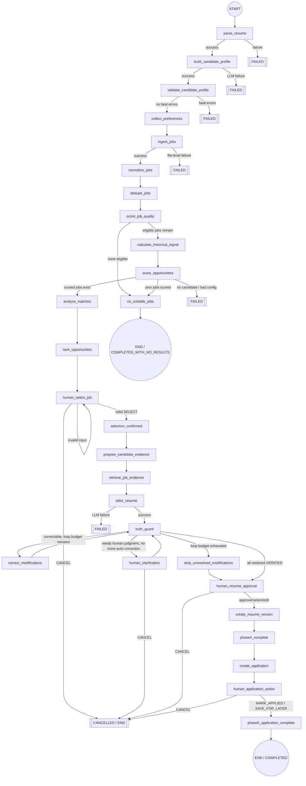

# HireLoop AI — Workflow (LangGraph Orchestration)

Status: **Implemented through Phase 5, unchanged in Phase 6** (Phase 6 added
the Streamlit UI and evaluation harness as consumers of this graph, not
changes to it). This documents exactly what `src/graph/workflow.py` builds
today — not the target end-state (see
docs/ARCHITECTURE.md for that distinction and what's still planned). For
Truth Guard's internal pipeline in depth, see docs/TRUTH_GUARD.md; for
application tracking, outcome analytics, the Learning Agent, and mem0,
see docs/LEARNING_LOOP.md.

LangGraph version: `1.2.11` (`langgraph-checkpoint` `4.2.0`,
`langgraph-checkpoint-sqlite` `3.1.1`).

## 1. Graph Diagram



A **separate** graph (`build_outcome_update_workflow()`, not chained off
this one) handles outcome recording — see §8h below.

## 2. Node List

| # | Node | Responsibility | Module |
|---|---|---|---|
| 1 | `parse_resume` | Deterministic text extraction from `resume_file_path` | `src/graph/nodes/resume.py` |
| 2 | `build_candidate_profile` | Profile Agent: resume text → `CandidateProfile` | `src/graph/nodes/resume.py` |
| 3 | `validate_candidate_profile` | Inspects the already-computed `ProfileValidationResult`; routes on fatal errors | `src/graph/nodes/resume.py` |
| 4 | `collect_preferences` | Normalizes the preferences supplied at invocation | `src/graph/nodes/preferences.py` |
| 5 | `ingest_jobs` | Loads the seeded JSON job batch | `src/graph/nodes/jobs.py` |
| 6 | `normalize_jobs` | Attaches normalized title/company/location metadata (originals preserved) | `src/graph/nodes/jobs.py` |
| 7 | `dedupe_jobs` | Removes duplicate postings, keeps a dedup log | `src/graph/nodes/jobs.py` |
| 8 | `score_job_quality` | Scores + excludes `LOW_QUALITY` jobs; `NEEDS_REVIEW` stays eligible | `src/graph/nodes/jobs.py` |
| 9 | `calculate_historical_signal` | Deterministic historical response signal per target role | `src/graph/nodes/scoring.py` |
| 10 | `score_opportunities` | Deterministic Opportunity Scoring Engine, per eligible job | `src/graph/nodes/scoring.py` |
| 11 | `analyze_matches` | Match Analyst on the top-N (default 5) by score | `src/graph/nodes/analysis.py` |
| 12 | `rank_opportunities` | Authoritative ranking with tie-breakers | `src/graph/nodes/analysis.py` |
| 13 | `human_select_job` | **Human-in-the-loop interrupt** | `src/graph/nodes/human.py` |
| 14 | `selection_confirmed` | Confirms the selection; graph continues into Phase 4 | `src/graph/nodes/human.py` |
| — | `no_suitable_jobs` | Graceful terminal state | `src/graph/nodes/terminal.py` |
| 15 | `prepare_candidate_evidence` | Extracts/dedupes candidate Evidence, indexes into Pinecone if configured | `src/graph/nodes/evidence.py` |
| 16 | `retrieve_job_evidence` | Per-requirement evidence retrieval (direct match / Pinecone / local fallback) | `src/graph/nodes/evidence.py` |
| 17 | `tailor_resume` | Resume Tailor Agent proposes modifications | `src/graph/nodes/tailoring.py` |
| 18 | `truth_guard` | Hybrid deterministic + LLM classification of every modification | `src/graph/nodes/tailoring.py` |
| 19 | `correct_modifications` | Applies each modification's deterministic safe rewrite | `src/graph/nodes/tailoring.py` |
| 20 | `strip_unresolved_modifications` | Removes modifications still unresolved after the loop cap | `src/graph/nodes/tailoring.py` |
| 21 | `human_clarification` | **Human-in-the-loop interrupt** for `NEEDS_HUMAN_CONFIRMATION` | `src/graph/nodes/clarification.py` |
| 22 | `human_resume_approval` | **Human-in-the-loop interrupt**; only `VERIFIED` modifications offered | `src/graph/nodes/resume_approval.py` |
| 23 | `create_resume_version` | Creates the `ORIGINAL` marker (once) and a new `APPROVED` `ResumeVersion` | `src/graph/nodes/resume_approval.py` |
| 24 | `phase4_complete` | Marks resume tailoring done; graph continues | `src/graph/nodes/resume_approval.py` |
| 25 | `create_application` | Persists a `READY_FOR_REVIEW` `Application` via `ApplicationTrackerService` | `src/graph/nodes/application.py` |
| 26 | `human_application_action` | **Human-in-the-loop interrupt**: mark applied / save / cancel | `src/graph/nodes/application.py` |
| 27 | `phase5_application_complete` | Marks the run `COMPLETED` | `src/graph/nodes/application.py` |
| — | `load_application` *(separate graph)* | Loads an `Application` + its event history by id | `src/graph/nodes/outcome.py` |
| — | `human_record_outcome` *(separate graph)* | **Human-in-the-loop interrupt**; flags suspicious sequences | `src/graph/nodes/outcome.py` |
| — | `record_application_event` *(separate graph)* | Appends the new `ApplicationEvent`, updates cached status | `src/graph/nodes/outcome.py` |
| — | `calculate_outcome_analytics` *(separate graph)* | Deterministic `OutcomeAnalytics` — no LLM | `src/graph/nodes/outcome.py` |
| — | `learning_agent` *(separate graph)* | Learning Agent interprets analytics into `LearningInsight`s | `src/graph/nodes/outcome.py` |
| — | `persist_strategy_insight` *(separate graph)* | Saves insights to business SQLite | `src/graph/nodes/outcome.py` |
| — | `sync_mem0` *(separate graph)* | Syncs to mem0, fallback-safe | `src/graph/nodes/outcome.py` |
| — | `outcome_update_complete` *(separate graph)* | Marks that run `COMPLETED` | `src/graph/nodes/outcome.py` |

Every node is a plain function `(state: HireLoopState, config: RunnableConfig) -> dict`
— no closures, no UI code. Non-serializable dependencies (the `LLMClient`,
the optional Pinecone `vector_index`) are injected via
`config["configurable"]` at invoke time, never stored in state.

## 3. Conditional Edges (`src/graph/routing.py`)

| Function | Branches |
|---|---|
| `route_after_parse_resume` | `build_candidate_profile` \| `failed` |
| `route_after_build_profile` | `validate_candidate_profile` \| `failed` |
| `route_after_profile_validation` | `collect_preferences` \| `failed` |
| `route_after_ingest_jobs` | `normalize_jobs` \| `failed` |
| `route_after_job_quality` | `calculate_historical_signal` \| `no_suitable_jobs` |
| `route_after_scoring` | `analyze_matches` \| `no_suitable_jobs` \| `failed` |
| `route_after_human_selection` | `selection_confirmed` \| `cancelled` |
| `route_after_truth_guard` | `correction_required` \| `human_confirmation` \| `max_loops` \| `verified` |
| `route_after_human_clarification` | `continue` (→ `truth_guard`) \| `cancelled` |
| `route_after_human_resume_approval` | `continue` (→ `create_resume_version`) \| `cancelled` |
| `route_after_human_application_action` | `continue` (→ `phase5_application_complete`) \| `cancelled` |
| `route_after_load_application` *(separate graph)* | `continue` \| `failed` |
| `route_after_human_record_outcome` *(separate graph)* | `continue` (→ `record_application_event`) \| `cancelled` |

Each is a small, pure function of `HireLoopState` with no side effects —
branching is never buried inside a node body.

`route_after_truth_guard`'s priority order (`src/graph/routing.py`):
correction is preferred over interrupting the human whenever budget
remains (it doesn't need to interrupt anyone); once no more automated
correction is possible, a pending `NEEDS_HUMAN_CONFIRMATION` takes the
human-clarification path; only once both are exhausted does the loop-cap
strip happen; with nothing left unresolved, the modification set proceeds
to human resume approval.

## 4. Job Eligibility & Quality Routing

Quality threshold (Part E, documented and versioned in
`src/config/workflow.py::JOB_QUALITY_EXCLUDED_RECOMMENDATIONS`):

- **`VALID`** → eligible for scoring, full confidence.
- **`NEEDS_REVIEW`** → remains eligible; its reduced `quality_score`
  already drags down the weighted opportunity score via the `job_quality`
  component (5% weight) — no separate penalty is layered on top.
- **`LOW_QUALITY`** → excluded from ranking entirely. This is
  `JobQualityResult.recommendation == "LOW_QUALITY"`, which itself means
  `quality_score < 40` or a critical flag (`missing_company` /
  `missing_description`) — see `src/services/job_quality.py`.

No job is ever silently dropped: every exclusion (duplicate or
low-quality) is recorded in `excluded_jobs` and produces a Decision Trace
event with a count.

## 5. Opportunity Scoring Node

Per eligible job: `CandidateProfile + JobQualityResult + StrategyInsight →
OpportunityScore`, via the unchanged Phase 1 `score_opportunity()`. No
scoring logic is reimplemented inside the graph.

- **Halts the whole workflow** (`FAILED`, `SCORING_ERROR`) if the
  candidate profile is missing, or if `get_scoring_config()`'s internal
  weight-sum/cap assertions fail — the workflow cannot produce trustworthy
  recommendations without either.
- **Isolates a single bad job**: if one job's data is malformed, it's
  recorded in `excluded_jobs` with reason `scoring_failed` and the batch
  continues.

## 6. Match Analyst Node (Top-N)

Every eligible job is scored deterministically first (node 10). Node 11
then runs the Match Analyst (an LLM call) only on the top `MATCH_ANALYST_TOP_N`
(default 5, `src/config/workflow.py`) by score-descending order — bounding
LLM latency/cost regardless of batch size. **The Match Analyst never
reorders anything**: `OpportunityScore` is a frozen Pydantic model, and
`rank_opportunities` (node 12) is the sole authority on final order.

Degradation:

- One job's analysis fails → that job keeps its deterministic score and
  rank; `match_analyses` simply has no entry for it. The Decision Trace
  says `"N failed and were marked unavailable."`
- **Every** top-N analysis fails (e.g. total provider outage) → the
  workflow does not fail. It proceeds to ranking and the human interrupt
  with deterministic scores/ranking intact and an explicit Decision Trace
  warning: `"Match analysis unavailable for all N top opportunities
  (provider outage); deterministic rankings retained."`

## 7. Ranking (`rank_opportunities`)

Primary sort: `final_score` descending. Deterministic tie-breakers, in
order: (1) `confidence` (HIGH beats MEDIUM beats LOW), (2) `quality_score`
descending, (3) `skill_match` component value descending, (4) `job_id`
ascending as a final stable tiebreak. Top `RECOMMENDATION_SET_SIZE`
(default 5) become the recommendation set shown to the human.

## 8. Human Job Selection Interrupt

The centerpiece of Phase 3. `human_select_job` calls LangGraph's
`interrupt()` with a compact payload:

```json
{
  "eligible_selections": [
    {"job_id": "job_ai_001", "title": "Senior AI Engineer", "company": "Nova Labs",
     "location": "Remote", "final_score": 83.4, "recommendation": "STRONG_MATCH",
     "confidence": "MEDIUM", "strengths": ["..."], "gaps": []}
  ],
  "action_required": "SELECT_JOB_OR_CANCEL"
}
```

The caller resumes with `Command(resume={"action": "SELECT", "job_id": "..."})`
or `Command(resume={"action": "CANCEL"})`.

**Invalid selection handling:** the node runs a `while True` loop around
`interrupt()`. On each resume, LangGraph replays the node from the top and
returns each already-answered `interrupt()` call's cached value instantly
— only a *new*, unanswered `interrupt()` call actually pauses again. So an
invalid `job_id` (not in the eligible set) or an unrecognized `action`
calls `interrupt()` a second time within the same node execution,
re-pausing with an `error` field added to the payload, without ever
leaving `human_select_job` or losing the original recommendation set. This
was verified directly against the installed LangGraph version before
relying on it (see `tests/test_workflow.py::test_invalid_job_selection_is_rejected_and_keeps_waiting`).

**Cancellation:** `workflow_status = CANCELLED`, a `WorkflowError` with
category `HUMAN_CANCELLED` is recorded, and the graph ends gracefully.

## 8a. Evidence Preparation & Retrieval (Phase 4)

`prepare_candidate_evidence` flattens every `Evidence` record already
attached across the `CandidateProfile` (skills, work experience, projects,
education, certifications) via `src/services/evidence_extraction.py`,
stamps each with `candidate_id`, and — only if a Pinecone `vector_index`
was supplied via `config["configurable"]["vector_index"]` and its health
check passes — indexes them under a per-candidate namespace. No vector
index configured (the MVP demo default) or a failed health check both
result in `evidence_index_status = "NONE"` and a Decision Trace note; the
workflow is unaffected either way, since retrieval works identically off
the local fallback.

`retrieve_job_evidence` extracts the selected job's requirements
deterministically (`src/services/job_requirements.py` — required + preferred
skills, plus a synthesized "N+ years experience" string) and, for each,
calls `EvidenceRetrievalService.retrieve_for_requirement`
(`src/services/evidence_retrieval.py`), which tries, in order:

1. **Direct profile match** — an exact, normalized skill name match against
   `candidate.skills` with attached evidence. No search needed.
2. **Pinecone** — if configured and healthy.
3. **Local fallback** (`src/services/local_evidence_search.py`) — normalized
   token overlap, no embeddings, no network. Used automatically whenever
   Pinecone is unconfigured, unhealthy, or a query fails, with a Decision
   Trace note: *"Pinecone evidence retrieval unavailable; local fallback
   used."*

The result (`RequirementEvidence`) never claims a requirement is
satisfied — it only says which of the candidate's own evidence looks
relevant, for the Tailor and Truth Guard to actually judge.

## 8b. Resume Tailor & Truth Guard (Phase 4)

`tailor_resume` calls the Resume Tailor Agent
(`src/agents/resume_tailor.py`), which may propose a modification for a
requirement the candidate doesn't actually have evidence for — this is
intentional; Truth Guard, not the Tailor, is the safety net. A Tailor LLM
failure halts the workflow (`FAILED`, `LLM_ERROR`).

`truth_guard` runs every proposed modification through the hybrid
deterministic + LLM classifier (`src/agents/truth_guard.py` — full design
in docs/TRUTH_GUARD.md) and updates each modification's `status` in
place. This node is re-entered on every correction pass and after every
clarification action, so it always reflects the latest state of all
modifications.

## 8c. Automated Correction Loop (Phase 4)

Bounded at `MAX_RESUME_REVISION_LOOPS = 2`
(`src/config/workflow.py`). `correct_modifications` replaces any
`PARTIALLY_SUPPORTED`/`UNSUPPORTED` modification's text with its Truth
Guard-suggested `suggested_safe_rewrite` (falling back to the
modification's own `original_text` when no rewrite was computed) and
increments `correction_pass_count`, then loops back to `truth_guard` for
re-classification. If a modification has no safe rewrite available (no
`original_text` and no verified fragment to build one from), it's left
unchanged and will be caught by `strip_unresolved_modifications` once the
loop budget is exhausted. No modification is ever asked of the Tailor a
second time — corrections use only Truth Guard's own deterministic
fallback text, never a fresh (and equally fallible) LLM guess.

## 8d. Human Clarification Interrupt (Phase 4)

Pauses for the first `NEEDS_HUMAN_CONFIRMATION` modification (processed
one at a time) with a payload of the claim, why evidence was insufficient,
the closest evidence IDs, and the safe option if any. Same invalid-input
re-prompt pattern as job selection (`while True` around `interrupt()`).
Four actions (`src/config/workflow.py::CLARIFICATION_ALLOWED_ACTIONS`):
`CONFIRM_WITH_EVIDENCE` (creates a new `HUMAN_CONFIRMATION` Evidence
record, never merged into resume-derived evidence), `REJECT_CLAIM`,
`USE_SAFE_REWRITE`, `CANCEL`. Every action re-enters `truth_guard` (except
`CANCEL`) so the modification set is always re-evaluated from a
consistent state.

## 8e. Human Resume Approval Interrupt (Phase 4)

Only modifications whose latest Truth Guard status is `VERIFIED` are ever
offered (`src/graph/nodes/resume_approval.py::_build_payload`) — this is
enforced structurally, not by convention. Five actions
(`src/config/workflow.py::RESUME_APPROVAL_ALLOWED_ACTIONS`):
`APPROVE_ALL`, `APPROVE_SELECTED` (validates every ID against the
offerable set, rejecting and re-prompting on any invalid ID),
`EDIT` (re-verifies the edited text through Truth Guard before it can be
offered — an edit is a new claim, never auto-approved), `REJECT_ALL`,
`CANCEL`.

## 8f. Resume Versioning (Phase 4)

`create_resume_version` never mutates the original parsed resume text. On
first approval it creates a marker `ResumeVersion`
(`resume_v1_<candidate_id>`, `status=ORIGINAL`, no approved modifications)
if one doesn't already exist, then always creates a new
`ResumeVersion` (`status=APPROVED`) referencing exactly
`approved_modification_ids` — even an approval of zero modifications
still creates a version, recording that outcome. `phase4_complete` then
sets `workflow_status = COMPLETED`.

## 8g. Application Tracking (Phase 5, same graph)

After `phase4_complete`, `create_application` builds an `Application`
record (`status=READY_FOR_REVIEW`) from `selected_job_id`, the approved
`ResumeVersion`, and the job's `OpportunityScore`, persists it via
`ApplicationTrackerService` (`src/services/application_tracker.py` — the
only code path that ever touches the business database directly), and
records an `APPLICATION_CREATED` event. `human_application_action` then
pauses for `MARK_APPLIED` / `SAVE_FOR_LATER` / `CANCEL` — **nothing is
ever submitted externally**; the human is only recording what they
themselves did. `MARK_APPLIED` records an `APPLIED` event and sets
`applied_at`. `phase5_application_complete` sets the final `COMPLETED`.

## 8h. Outcome Update Workflow (Phase 5, SEPARATE graph)

`build_outcome_update_workflow()` — deliberately **not** chained off
`build_workflow()`'s graph, since outcomes happen days or weeks later, not
in the same continuous run. Invoked with its own `thread_id` and
`target_application_id` in the initial state:

`load_application` → `human_record_outcome` (interrupt; suspicious
sequences like `OFFER` before ever `APPLIED` are flagged and require
explicit `confirm: true` to proceed, never invented timestamps — Part X)
→ `record_application_event` (appends, never rewrites) →
`calculate_outcome_analytics` (deterministic, no LLM —
`src/services/outcome_analytics.py`) → `learning_agent` → `persist_strategy_insight`
→ `sync_mem0` (fallback-safe) → `outcome_update_complete`.

Full design (application-level counting rules, sample-size confidence
bands, Learning Agent grounding/post-validation, mem0's role and
fallback) is in **docs/LEARNING_LOOP.md**.

## 9. Checkpointing

`src/graph/checkpointing.py::get_sqlite_checkpointer()` wraps LangGraph's
`SqliteSaver` over a local SQLite file (default
`data/workflow_checkpoints.db`, configurable via
`src/config/workflow.py::DEFAULT_CHECKPOINT_DB_PATH`).

**This is a deliberate, permanent architectural split, not a Phase 3
shortcut:**

| | LangGraph checkpoint DB | Business SQLite (`src/services/database.py`) |
|---|---|---|
| Holds | Interrupt/resume points, per-thread node execution history | Candidates, jobs, applications, outcomes |
| Keyed by | `thread_id` (one per workflow run) | Business entity IDs |
| Losing it costs | In-flight workflow runs only | Durable business records |
| Status | Implemented | Schema stub only; not yet wired into the graph |

A run resumes from exactly where it paused — re-invoking with the same
`thread_id` after a process restart continues from whichever interrupt it
last paused at (`human_select_job`, `human_clarification`, or
`human_resume_approval`) without re-running any already-completed node —
resume parsing, profile building, ingestion, scoring, or resume tailoring
(verified by `test_resume_does_not_repeat_completed_steps` and
`test_resume_from_clarification_does_not_repeat_tailor_resume`).

**Why state holds dicts, not Pydantic instances:** LangGraph's checkpoint
serializer *can* round-trip a raw Pydantic model via a pickle-style
fallback, but as of `langgraph` 1.2.x that path already emits a
"deserializing unregistered type ... will be blocked in a future version"
warning. `HireLoopState` instead stores every domain-model-shaped field as
`model.model_dump(mode="json")` — a plain dict. Nodes reconstruct the
typed model when they need to operate on it and dump it back before
returning. This keeps the checkpoint payload genuinely JSON-safe,
independent of any particular serializer's object-registration story, and
trivially portable to a different checkpointer backend later.

No Redis/Postgres/cloud infrastructure — SQLite is sufficient for a
single-user local MVP.

## 10. Error Taxonomy (`src/models/workflow_error.py`)

```python
class ErrorCategory(str, Enum):
    RESUME_PARSE_ERROR
    PROFILE_ERROR
    JOB_INGESTION_ERROR
    SCORING_ERROR
    LLM_ERROR
    INVALID_STATE
    HUMAN_CANCELLED
    UNKNOWN_ERROR
```

`WorkflowError` fields: `node`, `category`, `message` (display-safe — never
an API key, full resume text, or raw stack trace), `retryable`, `attempt`,
`timestamp`, `details` (also display-safe). LLM-originated errors reuse
`src.llm.errors.LLMErrorType`'s retryability classification
(`RETRYABLE_ERROR_TYPES = {TIMEOUT, RATE_LIMIT, PROVIDER_UNAVAILABLE}`)
rather than re-deriving it — `WorkflowError.retryable` is set from
`exc.error_type in RETRYABLE_ERROR_TYPES` when a node wraps an
`HireLoopLLMError`.

## 11. Failure / Degradation Behavior by Node

| Node | Failure mode | Behavior |
|---|---|---|
| `parse_resume` | Corrupt/missing/unsupported file | Halt (`FAILED`, `RESUME_PARSE_ERROR`), no blind retry |
| `build_candidate_profile` | LLM timeout/rate-limit | Handled by the LLM provider layer's own retry+fallback (Phase 2); only an exhausted failure reaches this node as `HireLoopLLMError` |
| `build_candidate_profile` | Malformed structured output after provider retries | Halt (`FAILED`, `LLM_ERROR`) |
| `validate_candidate_profile` | Fatal validation errors (e.g. impossible employment dates) | Halt (`FAILED`, `PROFILE_ERROR`) |
| `ingest_jobs` | Missing file / invalid JSON / wrong shape | Halt (`FAILED`, `JOB_INGESTION_ERROR`) |
| `ingest_jobs` | One malformed job entry in an otherwise-valid batch | Skipped with a warning; batch continues |
| `score_job_quality` | Zero jobs eligible after exclusion | Routes to `no_suitable_jobs`, not a failure |
| `score_opportunities` | Candidate profile unavailable, or invalid scoring config | Halt (`FAILED`, `SCORING_ERROR`) — the workflow cannot produce trustworthy recommendations |
| `score_opportunities` | One job's data malformed | Isolated (`excluded_jobs`), batch continues |
| `score_opportunities` | Zero jobs successfully scored | Routes to `no_suitable_jobs` |
| `analyze_matches` | One top job's analysis fails | Degrades gracefully; deterministic score/rank retained |
| `analyze_matches` | All top jobs' analyses fail | Degrades gracefully; deterministic score/rank retained, trace records the outage |
| `human_select_job` | Invalid `job_id` / unrecognized action | Rejected, re-prompts, stays `WAITING_FOR_HUMAN` |
| `human_select_job` | `CANCEL` | Clean `CANCELLED` end |
| `prepare_candidate_evidence` / `retrieve_job_evidence` | Pinecone unavailable/unconfigured | Deterministic local fallback used; Decision Trace note, workflow continues |
| `tailor_resume` | LLM failure after provider retries | Halt (`FAILED`, `LLM_ERROR`) |
| `truth_guard` | LLM semantic-layer failure (ambiguous fragment) | Fails closed to `NEEDS_HUMAN_CONFIRMATION`, never silently `VERIFIED` (docs/TRUTH_GUARD.md) |
| `truth_guard` | Deterministic `UNSUPPORTED` fragment present | LLM is never even consulted for that modification — the verdict is already final |
| `correct_modifications` | No safe rewrite available for a failing modification | Left unchanged; caught by `strip_unresolved_modifications` once the loop cap is reached |
| `human_clarification` | Invalid action | Rejected, re-prompts, stays paused |
| `human_clarification` | `CANCEL` | Clean `CANCELLED` end |
| `human_resume_approval` | Invalid modification id(s) in `APPROVE_SELECTED` | Rejected, re-prompts, stays paused |
| `human_resume_approval` | `EDIT` | Re-verified through Truth Guard before it can be offered — never auto-approved |
| `human_resume_approval` | `CANCEL` | Clean `CANCELLED` end |

No generic "retry everything N times" wrapper exists anywhere in the
graph — every retry/halt/isolate/degrade decision is specific to what
actually failed.

## 12. No-Suitable-Jobs Terminal State

`workflow_status = COMPLETED_WITH_NO_RESULTS` — an outcome of the workflow,
not a crash. `no_suitable_jobs_reason` always contains:

```json
{
  "ingested": 14,
  "duplicates_removed": 1,
  "low_quality_excluded": 1,
  "scoring_failures": 0,
  "eligible_scored": 0,
  "recommendation": "Broaden target roles/location or provide another job batch."
}
```

## 13. Example Decision Trace (real run, MockLLMProvider, seeded batch)

```
Resume parsed successfully: 595 characters extracted.
Candidate profile created: 6 skills, 2 work experiences, 1 projects.
Profile validation completed with 0 warning(s).
Preferences confirmed: 1 target role(s), 0 target location(s).
14 demo jobs ingested.
14 jobs normalized for comparison.
1 duplicate posting(s) removed.
1 low-quality listing(s) excluded; 12 eligible for scoring. 1 flagged NEEDS_REVIEW but remain eligible.
Historical signal computed for 1 role family (sample sizes: [0]).
12 opportunities scored using scoring model v1.0.
Top 5 opportunities selected for qualitative analysis; 5 match analyses completed.
12 opportunities ranked; top 5 selected as recommendations.
Human review required: select one opportunity or cancel.
Rejected invalid selection (action='SELECT', job_id='not-a-real-job'); awaiting a valid choice.
Human selected job job_ai_001: Senior AI Engineer at Nova Labs.
Job selection confirmed: job_ai_001.
13 candidate evidence records prepared for local retrieval (Pinecone not configured or unavailable).
Evidence retrieval completed for 6 job requirement(s).
Resume Tailor proposed 5 modification(s).
Truth Guard verified 3 modification(s). 2 unsupported.
Truth Guard correction pass 1/2 completed: 0 modification(s) rewritten using a deterministic safe fallback.
Truth Guard correction pass 2/2 completed: 0 modification(s) rewritten using a deterministic safe fallback.
2 unresolved modification(s) removed after 2 correction pass(es).
Human resume approval requested for 3 verified modification(s).
Human approved all 3 modification(s).
Resume version resume_v2_cand-demo approved with 3 modification(s).
Phase 4 resume tailoring workflow completed.
```

No hidden LLM chain-of-thought is ever recorded — only observable actions,
counts, and decisions.

## 14. Developer Demos

```bash
python -m scripts.run_phase3_demo   # resume -> ranking -> job selection only
python -m scripts.run_phase4_demo   # full flow through resume tailoring + approval
python -m scripts.run_phase5_demo   # full flow through application tracking + outcome/learning loop
```

All three drive the real compiled graph(s) (not a simulation) from the
terminal. `run_phase4_demo` deliberately selects a job (`job_ai_001`) the
demo candidate is missing a preferred skill for, so it always reproduces
the adversarial case: a Kubernetes-claiming modification gets
`UNSUPPORTED`, survives two correction passes unchanged (no safe rewrite
available), is stripped before the human ever sees it, and only the
verified Python/Machine Learning/LangChain modifications are offered for
approval. It then prints the original vs. final resume text hash (must
match) and the full Decision Trace.

`run_phase5_demo` prints the seeded DEMO historical analytics, runs the
main graph through `MARK_APPLIED`, then invokes the **separate** outcome
graph to record an `INTERVIEW`, showing the refreshed analytics, the
Learning Agent's grounded `LearningInsight`(s), the mem0 sync status, and
the full Decision Trace. All seeded data is explicitly printed as DEMO
DATA. All `input()`/`print()` calls live in the scripts — none in graph
nodes.
